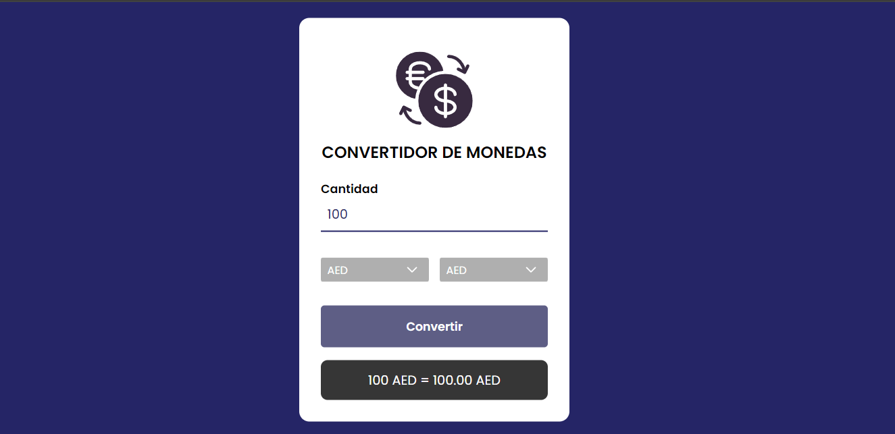
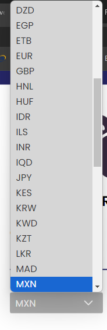
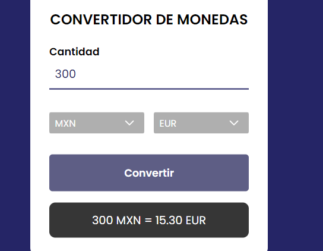

# Challenge Oracle - Alura / Convertidor de Monedas

Este proyecto es un convertidor de divisas desarrollado en JavaScript. Permite realizar conversiones entre diferentes monedas utilizando una API para las tasas de cambio actuales.

## Características

### 💰 Conversor de Divisas

- USD a otras monedas
- EUR a otras monedas
- JPY a otras monedas
- GBP a otras monedas
- AUD a otras monedas
- CAD a otras monedas
- CHF a otras monedas
- CNY a otras monedas
- SEK a otras monedas
- NZD a otras monedas

## Capturas de Pantalla

### Página Principal

### Selección de Monedas

### Resultados de la Conversión

Espero que les sirva, cualquier duda o comentario ponganse en contacto conmigo ❤️
